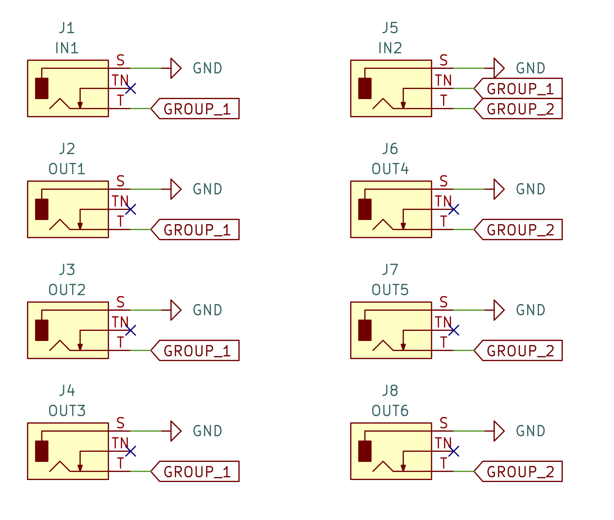

# Unbuffered Mult

An "unbuffered mult" is a passive signal splitter that splits one input signal into multiple outputs without using a powered buffer, like a TL074 op amp.
This means the signal can lose voltage or be slightly degraded with each signal tap, making it ideal for voltage non-critical signals like gates and triggers.
However, it is not recommended for voltage precise signals (CV), which require a buffered mult to maintain signal integrity.

**Note:** This is a learning exercise.

## Design intent

The intent of this design is to implement a 2hp wide EuroRack module.
The module will consist of two groups of four 3.5mm mono jacks.
There will be a common ground for the whole board. The first group of
four jacks will have their signal leads wired together, with their
switched terminal left floating.

The second group of four jacks will have their signal terminals wired together.
The first jack of the second group will have it's switched terminal connected
to the first group's signal wire.
This will normally connect the three output jacks into the first group if the
first socket of the second group is left unconnected.

If a cable is connected into the first socket of the second group, this will
disconnect the second group of sockets from the first group.

## Important dimensions

The width of the mainboard will be 9mm. The height of the board will be 110mm. The
thickness of the PCB will 1.6mm, the default thickness of a 2 layer PCB.

The faceplate dimensions are 2hp (9.8mm) wide, and 128.5 mm tall.

## Sources

- [fuzzySi](https://github.com/fuzzySi)'s [KiCad parts](https://github.com/fuzzySi/kicad)
- Wenzhou QingPu Electronics Co., Ltd's [WQP-WQP518MA](http://www.qingpu-electronics.com/en/products/WQP-PJ398SM-362.html)
- [DinkDonk](https://github.com/DinkDonk)'s [EDA 3D Model of the WQP-PJ398SM](https://github.com/elektrofon/eda-3d-models)
- [joem](https://github.com/joem)'s [Thonkiconn Breadboard Adapter V3](https://github.com/joem/thonkiconn_breadboard_adapter_v3)
- [thonk.co.uk](https://www.thonk.co.uk/)'s [Thonkiconn – 3.5mm Jack Sockets](https://www.thonk.co.uk/shop/thonkiconn/)
- [thonk.co.uk](https://www.thonk.co.uk/)'s [PJ398SM Datasheet](https://www.thonk.co.uk/wp-content/uploads/2018/07/Thonkiconn_Jack_Datasheet-new.jpg)
- [clacktronics](https://github.com/clacktronics) [AudioJacks](https://github.com/clacktronics/AudioJacks)
- [AI Synthesis](https://aisynthesis.com/)'s [AI001 Multiple](https://aisynthesis.com/product/multiple-eurorack-synthesizer-module/)
- [AI Synthesis](https://aisynthesis.com/)'s [AI001 Multiple Build Guide](https://aisynthesis.com/ai001-multiple-build-guide/)
- [Eurorack Panel Dimensions](https://www.exploding-shed.com/manuals-tutorials/manuals/standards-of-eurorack/eurorack-dimensions/) by [Exploding Shed](https://www.exploding-shed.com/)
- [EuroRack dimensions](https://midisoft.de/EuroRackDimensions/EuroRack_Dimensions.html)

## KiCanvas links

- [faceplate](https://kicanvas.org/?github=https%3A%2F%2Fgithub.com%2Fdomesticmouse%2Funbuffered_mult%2Fblob%2Fmain%2Fhardware%2Ffaceplate%2Ffaceplate.kicad_pro)
- [mainboard](https://kicanvas.org/?github=https%3A%2F%2Fgithub.com%2Fdomesticmouse%2Funbuffered_mult%2Fblob%2Fmain%2Fhardware%2Fmainboard%2Fmainboard.kicad_pro)
